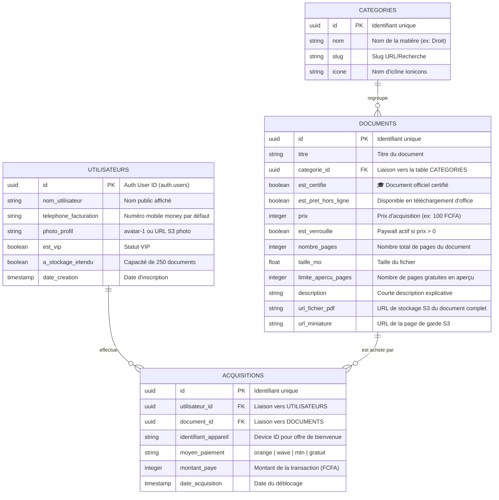

# Synthèse Technique Backend - Supabase & Base de Données (cauZon)

Cette fiche technique est destinée à l'ingénieur Backend en charge de la configuration de **Supabase** (PostgreSQL, Authentification, Stockage S3 et RLS) pour l'application **cauZon**. Elle est extraite de l'analyse du code client Frontend React Native.

---

## 👥 1. Architecture, Rôles & Sécurité (RLS)

L'application requiert une séparation stricte entre deux rôles :

### A. Rôle : Administrateur (`admin`)
*   **Permissions** : Publication, modification et suppression de documents ; certification des documents ; suivi des statistiques de vente ; attribution manuelle de droits de déblocage.
*   **Accès base de données** : Écriture totale (`INSERT`, `UPDATE`, `DELETE`) sur toutes les tables de documents, dossiers et profils.

### B. Rôle : Utilisateur / Étudiant (`student` / `authenticated`)
*   **Permissions** : Lecture des informations publiques des documents (métadonnées) ; lecture des $N$ premières pages gratuites d'aperçu d'un document ; déblocage d'un document via transactions monétaires.
*   **Accès base de données** : 
    *   Lecture seule (`SELECT`) sur les documents et dossiers.
    *   Écriture limitée (`INSERT` / `UPDATE`) sur ses propres données utilisateur, son historique d'achats et ses données de profil.

---

## 🗂️ 2. Modèle de Données (Schéma PostgreSQL / Supabase)

Voici la structure recommandée des tables PostgreSQL pour supporter la logique du frontend :

---

## 🔒 3. Politiques de Sécurité RLS (Row Level Security)

Les politiques de sécurité PostgreSQL de Supabase doivent être configurées pour protéger les documents payants :

### Table `CATEGORIES`
*   `ALL` pour les administrateurs.
*   `SELECT` pour tout le monde (`public` / `authenticated`).

### Table `DOCUMENTS`
*   `ALL` pour les administrateurs.
*   `SELECT` (Champs publics uniquement : `id, titre, categorie_id, est_certifie, est_pret_hors_ligne, prix, est_verrouille, nombre_pages, taille_mo, limite_apercu_pages, description, url_miniature`) pour les utilisateurs authentifiés.
*   `SELECT` (Champ `url_fichier_pdf`) : **Restreint**. L'accès au lien de téléchargement direct du PDF complet doit être soumis à une fonction PostgreSQL de vérification d'achat (voir ci-dessous).

### Table `ACQUISITIONS`
*   `ALL` pour les administrateurs.
*   `INSERT` : Autorisé pour `auth.uid() == utilisateur_id`.
*   `SELECT` : Autorisé uniquement si `auth.uid() == utilisateur_id`. (Un utilisateur ne peut pas voir les achats des autres).

---

## 🔐 4. Authentification & Cycle de Vie Utilisateur

1.  **Authentification Téléphone (OTP)** :
    *   Supabase Auth doit être configuré pour l'envoi de codes de validation SMS (via providers Twilio, Vonage, ou SMS-Partner).
    *   L'authentification génère un compte dans `auth.users`, ce qui doit déclencher un trigger PostgreSQL pour insérer une ligne par défaut dans la table publique `utilisateurs`.
2.  **Identifiant Unique de l'Appareil (Device ID)** :
    *   Le frontend récupère le Device ID natif (`Application.getAndroidId()` ou `Application.getIosIdForVendorAsync()`).
    *   **Offre de Bienvenue** : Le premier document débloqué (valeur 100 FCFA) est gratuit. Pour empêcher les abus, la table `ACQUISITIONS` doit indexer de manière unique `identifiant_appareil`. Une règle d'insertion empêche la validation d'une transaction à montant 0 (`moyen_paiement = gratuit`) si ce `identifiant_appareil` a déjà servi pour une acquisition précédente.

---

## 📁 5. Stockage des Fichiers (Supabase Storage Buckets)

Il faut configurer deux buckets de stockage sur Supabase :

### Bucket 1 : `document-thumbnails` (Public)
*   Contient les images de couverture miniatures des documents.
*   **Politique** : `SELECT` public autorisé. Écriture réservée aux administrateurs.

### Bucket 2 : `documents-pdf` (Privé & Sécurisé)
*   Contient les fichiers PDF complets.
*   **Politique d'accès sécurisé** : L'accès au document complet doit passer par une API Edge Function de Supabase qui vérifie si l'utilisateur possède une acquisition active pour ce `document_id` ou s'il est titulaire d'un abonnement `est_vip` actif. Si c'est le cas, elle génère un **lien signé temporaire (URL signée)** d'une durée de validité de 15 minutes.

---

## 🛠️ 6. API & Logiques de Paywall Frontend

*   **Gestion de l'aperçu** :
    *   Le frontend simule et affiche uniquement les pages $\le$ `limite_apercu_pages`.
    *   Si le document est verrouillé (`est_verrouille = true` et non présent dans les acquisitions de l'utilisateur), les pages suivantes affichent le Paywall d'achat.
    *   Dès la confirmation de la transaction via l'Edge Function de paiement, le frontend appelle `debloquerDocument(id)` pour forcer le lecteur à rendre les chapitres restants.
